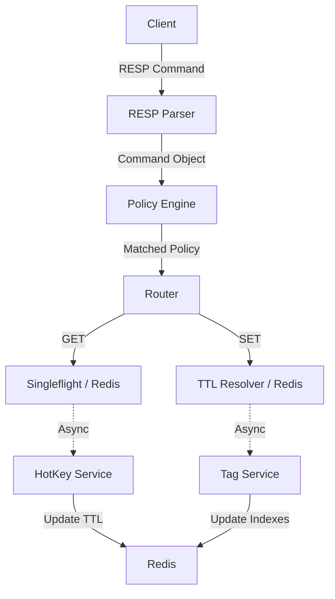

## **Aegis Request Life Cycle & Flow Model**

### **Overview**
Aegis operates as a high-performance, asynchronous interceptor. Unlike a simple proxy that just pipes bytes, Aegis parses the **RESP (Redis Serialization Protocol)** to apply policies, track hot keys, and manage tag-based invalidation.

---
### **1. Connection Entry & Lifecycle**
When a client connects to Aegis, the system initiates a dedicated lifecycle for that session.

1.  **TCP Accept**: The `serve()` function in `main.go` accepts the raw TCP connection.
2.  **Goroutine Per Connection**: Every connection is handed off to `handleConnection` in its own goroutine to ensure non-blocking I/O.
3.  **Parser Initialization**: A `resp.Parser` is attached to the connection, wrapping the `net.Conn` in a `bufio.Reader` for efficient buffered reads.
4.  **The Loop**: The `Conn.Handle()` method enters a persistent loop, reading commands one by one until the client disconnects or a timeout occurs.

---
### **2. Request Processing Flow (The Core)**
When a command (e.g., `SET user:123 "data"`) arrives, it flows through the following internal components:

#### **Step A: RESP Parsing**
* The `Parser` reads the raw bytes.
* It identifies the command type (Array vs. Inline).
* It populates a `resp.Command` struct containing the **Name** (`SET`), **Key** (`user:123`), and **Args** (`["data"]`).

#### **Step B: Policy Matching**
* The `Command` is passed to the **Policy Engine**.
* The engine performs a **Pattern Match** (using `path.Match`) against the `aegis.yaml` configuration (e.g., matching `user:*` to a specific policy).
* If a match is found, the relevant `PolicyConfig` (TTL, Singleflight, Tags, HotKey settings) is attached to the request.

#### **Step C: Routing**
* The `proxy.Router` inspects the command name.
* **Known Commands**: Routed to specific optimized handlers (`Get`, `Set`, `Del`).
* **Aegis Commands**: Routed to internal logic (e.g., `AEGIS.INVALIDATE`).
* **Unknown Commands**: Routed to `DefaultHandler` for transparent pass-through to Redis.

---

### **3. Operational Handlers (Behavioral Flow)**

#### **The GET Flow (Optimized Reads)**
1.  **Singleflight**: If enabled in policy, concurrent requests for the same key are deduplicated using `internal/singleflight`. Only one request hits Redis; others wait for the result.
2.  **Redis Fetch**: Aegis fetches the value from the backend.
3.  **Async HotKey Tracking**: 
    * The key is pushed into the `HotKeyService` channel. 
    * Background workers increment the local frequency counter.
    * If the **Threshold** is met, Aegis sends an `EXPIRE` command to Redis to proactively extend the TTL based on the **Multiplier**.

#### **The SET Flow (Write-Through with Metadata)**
1.  **TTL Resolution**: Aegis calculates the final TTL by comparing the client's request (`EX`) against the Policy's `MinTTL` and `MaxTTL` bounds.
2.  **Redis Commit**: The command is sent to Redis with the resolved TTL.
3.  **Async Tag Registration**:
    * If tags are defined in the policy, a `TagEvent` is pushed to the `TagService`.
    * Background workers update two sets in Redis:
        * **Forward Index**: `tag:<name>` → `{keys}`
        * **Reverse Index**: `key-tags:<key>` → `{tags}`

#### **The DEL / Invalidate Flow (Cleanup)**
1.  **DEL**: Deletes the key in Redis and triggers async cleanup of local HotKey counters and Redis Tag indexes.
2.  **Invalidate**: Executes a **Lua Script** in Redis that yanks all keys associated with a specific tag, ensuring atomic mass-deletion.

---
### **4. Summary Flow Diagram**

---

### **5. Scaling & State Characteristics**
* **Local State**: `HotKeyService` counters are local to the Aegis instance (In-memory). Horizontal scaling means each instance tracks its own hot keys.
* **Global State**: `TagService` metadata and actual data reside in **Redis**. This ensures that an invalidation request sent to any Aegis instance will affect the entire system consistently.